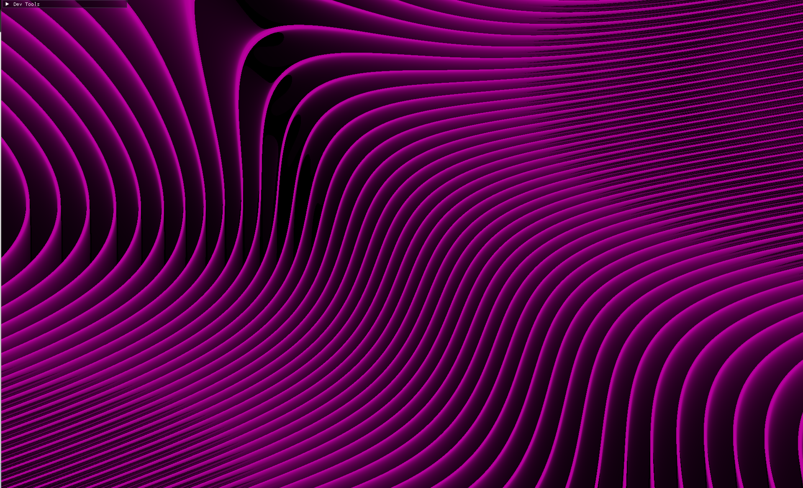
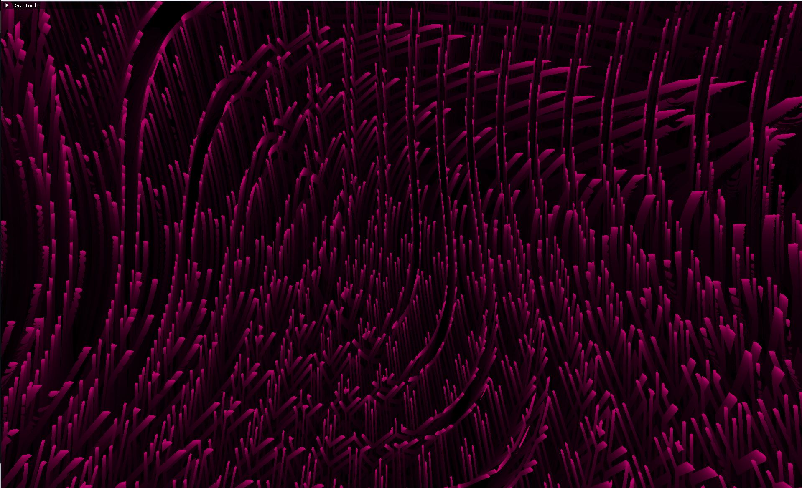
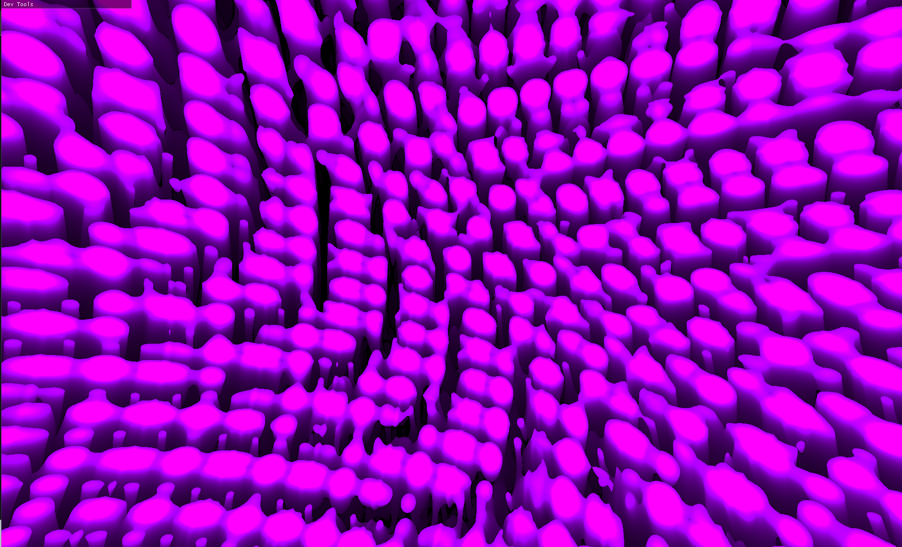
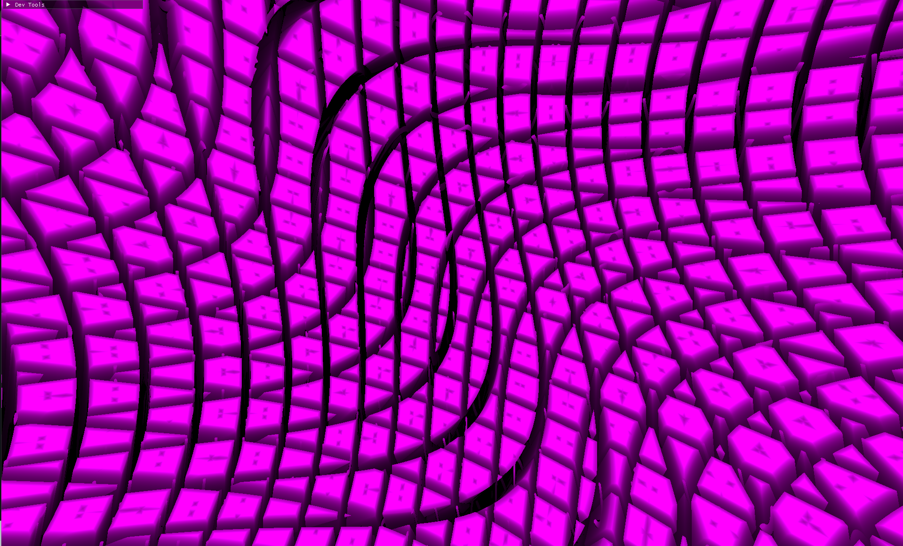

# March them rays yo

To be YouBute content soon. If you know what you're doing feel free to PR. We would love for some code review if you're cracked!

### TODO
- Loading screen, title screen
- Set up a bunch of uniforms 22?
- Audio input
- Figure out how to get the funky nob thing working
- Remove the visual artifacts of the clipping plane?
- Lighting

### DOING
- Deeper fractals

### DONE
- Time uniform
- Remove C++ bloat
- Mirrors

## Media:
#### These are some examples we have for some neat visuals. We are working on 3d fractals.
### Tame Impala Inspired

### Alien Grass

### "Cool" Blobs

### Lame Cubes

